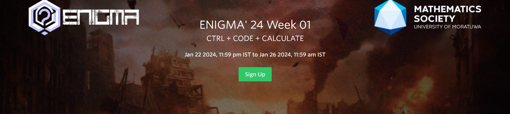

# 𝐄𝐍𝐈𝐆𝐌𝐀 ‘𝟐𝟒 : *Road to Warzone* 

Welcome to the repository for 𝐄𝐍𝐈𝐆𝐌𝐀 ‘𝟐𝟒 - *Road to Warzone*! This workshop series is organized by the Mathematics Society of the University of Moratuwa and aims to provide both beginners and experienced coders with valuable insights into Python and Python-related mathematics.

## Workshop Overview
- **Title:** 𝐄𝐍𝐈𝐆𝐌𝐀 ‘𝟐𝟒 : *Road to Warzone*
- **Theme:** Ctrl+Code+Calculate
- **Chapters:**
  1. Weekly workshop series for beginners, covering the basics of Python and Python-related mathematics.
  2. A challenging hackathon to put your knowledge to the test.

## Getting Started
This repository contains materials and solutions related to the workshop series. You can find explanations, code samples, and additional resources to help you grasp the concepts covered in each session.

## How to Contribute
1. Fork the repository
2. Create a new branch for your contributions
3. Make your changes and commit with clear and descriptive messages
4. Push your changes to your forked repository
5. Create a pull request to merge your changes into this repository

## Contact
If you have any questions or need further assistance, feel free to reach out:

- [hari.27nr@gmail.com]

Happy coding and enjoy your journey in 𝐄𝐍𝐈𝐆𝐌𝐀 ‘𝟐𝟒! 🚀🐍

---
