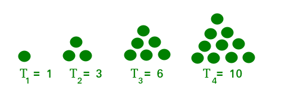

# Mesmerizing Triangular Numbers

Dive into the mesmerizing world of triangular numbers, where each number unveils a unique pattern!

A triangular number is the sum of natural numbers up to a certain point, in other words, a number is termed as a triangular number if we can represent it in the form of a triangular grid of points such that the points form an equilateral triangle, and each row contains as many points as the row number, i.e., the first row has one point, the second row has two points, the third row has three points, and so on.

   <!-- Image 1.0 -->

Here your task is to output the integer representing the position of the given triangular number in the sequence.

## Input Format
An integer representing a triangular number.

## Output Format
Return an integer representing the position of the given triangular number in the sequence.

### Examples:
For the input 10, the position of the triangular number is represented as: 4

For the input 21, the position of the triangular number is represented as: 6

For the input 36, the position of the triangular number is represented as: 8

## Sample Input 0
5050

## Sample Output 0
100

## Sample Input 1
435

## Sample Output 1
29

## Sample Input 2
153

## Sample Output 2
17

Dive into the enigmatic world of triangular numbers and unveil the patterns hidden within! 🌐🔍✨
